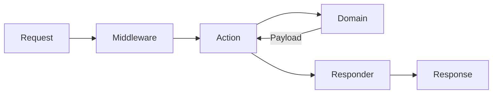

> Documentation Index
> Fetch the complete documentation index at: https://docs.phalcon.io/llms.txt
> Use this file to discover all available pages before exploring further.

# Tutorial - Vökuró ADR

## Vökuró ADR

[Vökuró ADR][github_vokuro_adr] is the [Action-Domain-Responder][adr_pattern] port of the [Vökuró][tutorial_vokuro] sample application. It offers the same features - login, sign up, ACL permissions, user and profile management, forms, and transactional e-mail - rebuilt as ports and adapters. The same use cases as the MVC version, arranged so that no `Phalcon\Di\DiInterface` reaches the delivery ring.

Vökuró ADR runs on **Phalcon v6** (the `phalcon/phalcon` PHP package). Phalcon v5 (the C extension) does not ship an ADR stack yet, so there is no v5 build.

Where the MVC tutorial has controllers, models, and views, this one has actions, domains, and responders. Read it as the companion to the [ADR overview][adr] and [Migrating from MVC][mvc_to_adr] pages: those describe the framework components, this shows a complete application built on them.

:::info[NOTE]
You can use Vökuró ADR as a starting point for an application built on the ADR pattern. It is a reference, not a template that fits every need.
:::

:::warning[WARNING]
This tutorial assumes you are familiar with the Action-Domain-Responder pattern. See the [ADR overview][adr] for an introduction.
:::

:::warning[WARNING]
The code below is trimmed to increase readability. The full source is in the [repository][github_vokuro_adr].
:::

## Installation

The quickest path on a local PHP host is Composer. It downloads the application from Packagist, installs the dependencies, and copies `resources/.env.example` to `.env`:

```bash
composer create-project phalcon/vokuro-adr vokuro-adr
cd vokuro-adr
```

The application runs on the bundled `phalcon/phalcon` (v6) package, so no extension is required. Point `.env` at a MySQL database, then create and seed the schema:

```bash
composer migrate
composer seed
php -S localhost:8080 -t public
```

The Docker stack needs nothing on the host except Docker. It defines the application, a MySQL 8.0 database, and a [Mailpit][mailpit] SMTP catcher so no e-mail leaves the host:

```bash
cp resources/.env.example .env
docker compose up -d --build

docker compose exec app composer migrate
docker compose exec app composer seed
```

The application is then on [http://localhost:8081](http://localhost:8081) and Mailpit on [http://localhost:8026](http://localhost:8026). Sign in with a seeded account, for example `sarah.connor@skynet.dev` / `password1`.

## Structure

The source follows the direction of a request. Each ring depends only on the one beneath it:

```text
src/
Action/          one class per route (delivery)
Responder/       turns a payload into a response (delivery)
Middleware/      runs around the action (delivery)
Forms/           renders form fields (delivery)
Domain/          use cases, entities, value objects, collections
Contracts/       the ports the domain depends on
Application/     policy adapters (ACL, authorization, remember-me)
Infrastructure/  technology-bound adapters (repositories, mail, http, view)
AppFront.php     the composition root
```

The delivery ring (`Action`, `Responder`, `Middleware`, `Forms`) speaks HTTP. The `Domain` does not. Everything the domain needs is a port in `Contracts`, and the adapters that satisfy those ports live in `Application` and `Infrastructure`.

## The request flow

A request travels **Action → Domain → Responder**:



`AppFront` boots a container, the router maps the path to an action, the global and route middleware run, the action calls a domain and hands the returned payload to a responder, and the responder produces the response. The payload is the only thing that crosses the domain boundary.

## Action

An action is one class per route. It reads the request, calls a domain, and hands the payload to a responder. It carries no business rules. See the [Actions][adr_actions] page for the contract.

The action that shows the registration form does nothing but render a template:

```php
<?php

namespace Vokuro\Action\Session;

use Phalcon\ADR\Payload\Payload;
use Phalcon\Contracts\ADR\Action;
use Phalcon\Contracts\Http\AttributeRequest;
use Phalcon\Http\Response;
use Phalcon\Http\ResponseInterface;
use Vokuro\Responder\AuthResponder;

final class GetSessionSignup implements Action
{
public function __construct(private AuthResponder $responder)
{
}

public function __invoke(AttributeRequest $request): ResponseInterface
{
    return ($this->responder->withTemplate('session/signup'))(
        $request,
        new Response(),
        Payload::success()
    );
}
}
```

The responder the action **type-hints** is how it chooses a layout. This action asks for the `AuthResponder`, so the page is rendered in the authentication layout. The action never names a layout string.

## Domain

A domain is a use case. It takes a `Phalcon\ADR\Input\Input`, does its work through ports, and returns a payload. It knows nothing about HTTP. See the [Domain][adr_domain] and [Input][adr_input] pages for the contracts.

The rules the sign up form used to declare now live in the domain: required fields, password length, the confirmation match, uniqueness of the address. `SignUp` validates the input, creates the account, issues a confirmation code, and mails it:

```php
<?php

namespace Vokuro\Domain\Session;

use Phalcon\ADR\Input\Input;
use Phalcon\ADR\Payload\Payload;
use Phalcon\Contracts\ADR\Payload\Payload as PayloadInterface;
use Phalcon\Encryption\Security;
use Vokuro\Contracts\Mailer;
use Vokuro\Contracts\Repository\EmailConfirmationRepository;
use Vokuro\Contracts\Repository\UserRepository;

final class SignUp
{
public function __construct(
    private UserRepository $users,
    private EmailConfirmationRepository $confirmations,
    private Security $security,
    private Mailer $mailer
) {
}

public function __invoke(Input $input): PayloadInterface
{
    $name  = trim((string) $input->get('name'));
    $email = trim((string) $input->get('email'));

    $messages = $this->validate(/* ... */);

    if ([] !== $messages) {
        return Payload::invalid($messages);
    }

    $userId = $this->users->add([
        'name'     => $name,
        'email'    => $email,
        'password' => $this->security->hash((string) $input->get('password')),
        // ...
    ]);

    $this->confirm($userId, $name, $email);

    return Payload::created(['id' => $userId, 'email' => $email])
        ->withMessages(['A confirmation mail has been sent to ' . $email]);
}
}
```

The domain depends on ports (`UserRepository`, `EmailConfirmationRepository`, `Mailer`), never on a concrete class. It returns a payload for every outcome: `Payload::invalid()` when a field is wrong, `Payload::created()` when the account is made.

Entities and value objects live alongside the use cases in `Domain\Model` and are readonly. Typed collections extend `Phalcon\Support\Collection` and are keyed by id.

## Payload

The payload is the contract between the domain and the responder. It carries a **status** (a domain-level outcome), a **result** (the data a success produced), **messages** (errors or notices, keyed by field where they belong to one), and **extras** (view state the result should not carry). See the [Payload][adr_payload] page for the full surface.

Build a payload with a named factory rather than setting the status by hand. The responder maps each status to an HTTP code:

| Factory | Status | HTTP |
|-------------------------------|---------------------|------|
| `Payload::success($result)`   | `SUCCESS`           | `200` |
| `Payload::created($result)`   | `CREATED`           | `201` |
| `Payload::found($result)`     | `FOUND`             | `302` (redirect) |
| `Payload::invalid($messages)` | `NOT_VALID`         | `422` |
| `Payload::notFound($messages)`| `NOT_FOUND`         | `404` |
| `Payload::forbidden($messages)`| `NOT_AUTHORIZED`   | `403` |
| `Payload::error($messages)`   | `ERROR`             | `500` |

A `created` payload can still carry a notice through `withMessages()`, as `SignUp` does above. An unmapped status resolves to `500`, never a silent `200`.

## Responder

A responder turns a payload into a response. It is mechanical: no decision about *what* happened, only how to present it. See the [Responders][adr_responders] page for the framework responders.

The application uses five:

| Responder | Produces |
|--------------------------------|-----------------------------------------------|
| `ViewResponder` (framework)    | HTML from a template, status from the payload |
| `AuthResponder`                | the same, in the authentication layout |
| `PrivateResponder`             | the same, in the management (sidebar) layout |
| `RedirectResponder` (framework)| a `302` to a `Redirect` result |
| `ErrorPageResponder`           | the error page for a browser, JSON for an API client |

`AuthResponder` and `PrivateResponder` each wrap one `ViewResponder` bound to their layout. A renderer knows a single layout, so the layout an action wants is declared by which responder it asks for:

```php
<?php

namespace Vokuro\Responder;

use Phalcon\ADR\Responder\ViewResponder;
use Phalcon\Contracts\ADR\Payload\Payload;
use Phalcon\Contracts\ADR\Responder\Responder;
use Phalcon\Http\RequestInterface;
use Phalcon\Http\ResponseInterface;

final class AuthResponder implements Responder
{
public function __construct(private ViewResponder $responder)
{
}

public function __invoke(
    RequestInterface $request,
    ResponseInterface $response,
    Payload $payload
): ResponseInterface {
    return ($this->responder)($request, $response, $payload);
}

public function withTemplate(string $template): static
{
    $cloned            = clone $this;
    $cloned->responder = $this->responder->withTemplate($template);

    return $cloned;
}
}
```

## Ports and adapters

Everything the actions and domains depend on is a **port** - a small interface in `Contracts`. The adapters that implement them are split by responsibility.

`Application` holds policy with no framework: `Acl` (the resource and action map), `Authorizer` (grants per profile), and `RememberMe` (the cookie sign-in).

`Infrastructure` holds the technology-bound adapters: the eight repositories over `Phalcon\DataMapper` (a `Connection` and a `QueryFactory`, returning domain objects), the Symfony-backed `Mailer`, the `Cookies` adapter over the PHP runtime, the `Csrf` adapter, and the view renderer.

| Port (`Contracts`) | Adapter |
|------------------------|---------------------------------|
| `Repository\*` (8)     | `Infrastructure\Repository\*`   |
| `Mailer`               | `Infrastructure\Mail\Mailer`    |
| `Cookies`              | `Infrastructure\Http\Cookies`   |
| `Csrf`                 | `Infrastructure\Http\Csrf`      |
| `Authorization`        | `Application\Authorizer`        |

A domain depends only on the port, so the storage or transport behind it can change without the domain noticing. Tests swap in in-memory fakes of the same ports.

CSRF is worth a note. It sits behind the `Csrf` port - `token()` for views, `check($request)` for actions - with the adapter wrapping the injected `Phalcon\Encryption\Security`. The `'csrf'` field name and the token dance stay out of the actions and views: a form renders `$csrf->token()`, and the action asks `$this->csrf->check($request)`.

## Middleware

Middleware runs around the action. See the [Middleware][adr_middleware] page for the contract. Vökuró ADR has three:

- `RememberMeLogin` is global. It signs a returning visitor in from the cookie before anything else runs.
- `RequireLogin` guards the routes that need an account.
- `RequirePermission` guards the `Users`, `Profiles`, and `Permissions` routes against the ACL.

Each implements `Phalcon\Contracts\ADR\Middleware` and receives the next handler in the chain.

## The composition root

`src/AppFront.php` extends `Phalcon\ADR\Front\AbstractHttpFront`. It builds a `Phalcon\Container\Container`, loads the environment, and registers the providers - the services above, the session, logger, and renderers. Its `getApplication()` override builds the `Phalcon\ADR\Application`, sets the router's base namespace with `setBaseNamespace()`, and attaches the route guards with `secureWith()` - `RequireLogin` and `RequirePermission` on the `Users`, `Profiles`, and `Permissions` namespaces. The framework then matches the route, runs the middleware and action, and emits the response. See the [Front Controller][adr_front] page for the boot sequence.

Two choices are deliberate:

- **`Phalcon\DataMapper`, not `Mvc\Model`.** The ORM resolves its services through a `Phalcon\Di\DiInterface` an ADR application does not have. The [data mapper][datamapper] needs no container.
- **`.phtml` templates, not Volt.** Registering a view engine requires a `DiInterface`, so the views are plain PHP. Templates receive `tag` (the `TagFactory`), `url`, and `csrf` as variables rather than reaching into a container.

## Sign Up, end to end

The registration flow shows every ring in one pass.

**The form** renders the fields and nothing more. It declares no validators - the rules moved to the domain:

```php
<?php

namespace Vokuro\Forms;

use Phalcon\Forms\Element\Password;
use Phalcon\Forms\Element\Text;
use Phalcon\Forms\Form;

class SignUpForm extends Form
{
public function initialize(): void
{
    $this->add(new Text('name'));
    $this->add(new Text('email'));
    $this->add(new Password('password'));
    $this->add(new Password('confirmPassword'));
    // terms check + submit ...
}
}
```

**The GET action** (`GetSessionSignup`, shown earlier) renders `session/signup` in the auth layout with `Payload::success()`. The template renders the form and a hidden `$csrf->token()` field.

**The POST action** checks the token, then delegates to the domain. It renders the same template either way - with the per-field errors, or with the confirmation notice:

```php
final class PostSessionSignup implements Action
{
public function __construct(
    private SignUp $domain,
    private AuthResponder $responder,
    private Csrf $csrf
) {
}

public function __invoke(AttributeRequest $request): ResponseInterface
{
    $payload = Payload::invalid(
        ['csrf' => 'The form has expired, please try again']
    );

    if (true === $this->csrf->check($request)) {
        $payload = ($this->domain)(Input::fromRequest($request));
    }

    return ($this->responder->withTemplate('session/signup'))(
        $request,
        new Response(),
        $payload
    );
}
}
```

**The domain** (`SignUp`, shown earlier) validates the input. On a bad field it returns `Payload::invalid($messages)`, keyed by field, and the template puts each message under the input it belongs to. On success it hashes the password, adds the user through the `UserRepository`, issues a confirmation code, mails it through the `Mailer` port, and returns `Payload::created()` with the confirmation notice.

**The responder** flattens the payload into the template variables - `$result`, `$messages`, `$extras` - renders `session/signup` inside the auth layout, and sets the response status from the payload's status. A `NOT_VALID` payload renders the form again with errors under the fields; a `CREATED` payload renders it with the confirmation notice. No branch in the action decides which - the payload does.

The account stays inactive until the visitor follows the link in the confirmation mail, which Mailpit captures during development.

## Conclusion

Vökuró ADR keeps HTTP at the edges. Actions read the request and choose a responder; domains hold the rules and return a payload; responders present it. The pieces in between are ports, and their adapters are wired once in `AppFront`. The result is a set of small units that can be understood and tested in isolation, on Phalcon v6 with no `DiInterface` in the delivery ring.

## References

- [Action-Domain-Responder][adr_pattern] - the pattern
- [ADR overview][adr] - the framework components
- [Migrating from MVC][mvc_to_adr] - the MVC-to-ADR map
- [Vökuró (MVC) tutorial][tutorial_vokuro] - the same application in MVC
- [Vökuró ADR repository][github_vokuro_adr] - the full source

[adr]: /5.20/adr/
[adr_actions]: /5.20/adr-actions/
[adr_domain]: /5.20/adr-domain/
[adr_front]: /5.20/adr-front-controller/
[adr_input]: /5.20/adr-input/
[adr_middleware]: /5.20/adr-middleware/
[adr_pattern]: https://pmjones.io/adr/
[adr_payload]: /5.20/adr-payload/
[adr_responders]: /5.20/adr-responders/
[datamapper]: /5.20/datamapper/
[github_vokuro_adr]: https://github.com/phalcon/vokuro-adr
[mailpit]: https://mailpit.axllent.org
[mvc_to_adr]: /5.20/mvc-to-adr/
[tutorial_vokuro]: /5.20/tutorial-vokuro/

Source: https://docs.phalcon.io/5.20/tutorial-vokuro-adr/index.mdx
