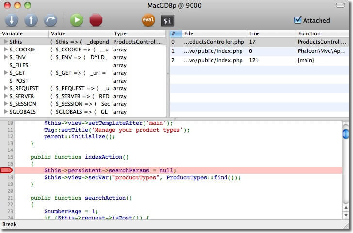

# Debug

- - -

## Overview



PHP offers tools to debug applications with notices, warnings, errors, and exceptions. The [Exception class][exception]
offers information such as the file, line, message, numeric code, backtrace, etc. of where an error occurred. OOP
frameworks like Phalcon mainly use this class to encapsulate this functionality and provide information back to the
developer or user.

Phalcon executes methods in the PHP userland, providing the same debugging capabilities as other PHP-based frameworks
offer.

## Constructor

[Phalcon\Support\Debug][debug] provides visual aids as well as additional information for developers to easily locate
errors produced in an application.

!!! danger "DANGER"

    Please make sure that this component is not used in production environments, as it can reveal information about your server to attackers

The following screencast explains how it works:

<div align='center'>
    <iframe width="560" height="315" src="https://www.youtube.com/embed/Mk5ObSQmGpQ" frameborder="0" allow="accelerometer; autoplay; encrypted-media; gyroscope; picture-in-picture" allowfullscreen></iframe>
</div>

To enable it, add the following to your bootstrap:

```php
<?php

use Phalcon\Support\Debug;

$debug = new Debug();

$debug->listen();
```

or using a shorter syntax:

```php
<?php

(new Phalcon\Support\Debug())->listen();
```

!!! warning "WARNING"

    Any `try`/`catch` blocks must be removed or disabled to make this component work properly.

By default, the component will listen for uncaught exceptions but not low-severity errors (warnings, notices, etc.). You
can modify this behavior by passing relevant parameters in `listen()`

- `exceptions` - bool
- `lowSeverity` - bool

In the example below, do not listen to uncaught exceptions but listen to non-silent notices or warnings (low severity):

```php
<?php

use Phalcon\Support\Debug;

$debug = new Debug();

$debug->listen(false, true);
```

If your application flow is different, or do not wish to pass the parameters on `listen()`, you can always use
`listenExceptions()` and `listenLowSeverity()`:

```php
<?php

use Phalcon\Support\Debug;

$debug = new Debug();

$debug
    ->listenExceptions()
    ->listenLowSeverity()
    ->listen();
```

!!! info "NOTE"

    The `listenExceptions()` and `listenLowSeverity()` are **ON** switches. If you wish to switch listening to exceptions or low severity errors **OFF** you need to pass `false` in the `listen()` method.

## Getters

There are a few getters available that offer information about the component. Extending those could also change the
behavior of the component visually.

| Method            | Returns  | Description                                                         |
|-------------------|----------|---------------------------------------------------------------------|
| `getCssSources()` | `string` | Returns the stylesheets used to display the contents on screen      |
| `getJsSources()`  | `string` | Returns the javascript files used to display the contents on screen |
| `getVersion()`    | `string` | Returns the link to the current version documentation               |

Extending the component and overriding the `getCssSources()` for instance to return different CSS HTML directives will
change the appearance of the output on screen. By default the component serves a single `debug.css` and `debug.js`
bundle from the configured URI (see `setUri()` below). For broader changes to the markup, swap the renderer instead
(see the [Renderer](#renderer) section).

## Setters

[Phalcon\Support\Debug][debug] also offers some setters to better customize the output when an error occurs in your
application.

| Method                                        | Description                                                                                         |
|-----------------------------------------------|-----------------------------------------------------------------------------------------------------|
| `setShowBackTrace(bool $showBackTrace)`       | Show/hide the exception's backtrace                                                                 |
| `setShowFileFragment(bool $showFileFragment)` | Show/Hide the file fragment in the output (related to the exception)                                |
| `setShowFiles(bool $showFiles)`               | Show/Hide the files in the backtrace                                                                |
| `setUri(string $uri)`                         | The base URI for static resources (see also the Getters section for customization of the component) |

## Renderer

[Phalcon\Support\Debug][debug] is a thin coordinator: it collects the data for an uncaught exception and then delegates
the HTML generation to a *renderer*. The default renderer is [Phalcon\Support\Debug\Renderer\HtmlRenderer][debug-htmlrenderer],
which produces the exception page (masthead, error card, tabbed Request/Server/Included Files/Memory/Variables context,
and collapsible backtrace frames).

You can retrieve or replace the renderer at runtime:

| Method                              | Returns    | Description                            |
|-------------------------------------|------------|----------------------------------------|
| `getRenderer()`                     | `Renderer` | Returns the currently active renderer  |
| `setRenderer(Renderer $renderer)`   | `static`   | Replaces the renderer used for output  |

Every renderer implements [Phalcon\Contracts\Support\Debug\Renderer][debug-renderer-contract]:

```php
<?php

namespace Phalcon\Contracts\Support\Debug;

use Phalcon\Support\Debug\Report\ExceptionReport;

interface Renderer extends TemplateAware
{
    public function getCssSources(string $uri): string;

    public function getJsSources(string $uri): string;

    public function getVersion(): string;

    public function render(ExceptionReport $report): string;
}
```

The `render()` method receives a [Phalcon\Support\Debug\Report\ExceptionReport][debug-report] value object holding the
collected data (class name, message, file, line, backtrace, superglobals, included files, memory usage, and any
variables added with `debugVar()`). To produce a completely different output (for example JSON for an API, or a
slimmed-down page), implement the contract and register it:

```php
<?php

use MyApp\Debug\JsonRenderer;
use Phalcon\Support\Debug;

$debug = new Debug();

$debug
    ->setRenderer(new JsonRenderer())
    ->listen();
```

### Templates

Rather than concatenating HTML in code, the default renderer keeps its markup in a set of named template strings. Each
template uses `%placeholder%` tokens that are filled with the relevant data when the page is rendered. Renderers expose
this through [Phalcon\Contracts\Support\Debug\TemplateAware][debug-templateaware-contract]:

```php
<?php

namespace Phalcon\Contracts\Support\Debug;

interface TemplateAware
{
    public function getTemplate(string $name): string;

    public function setTemplate(string $name, string $template): static;
}
```

This lets you tweak a single piece of the output without subclassing the renderer. For instance, to change the version
badge in the masthead:

```php
<?php

use Phalcon\Support\Debug;

$debug    = new Debug();
$renderer = $debug->getRenderer();

$renderer->setTemplate(
    'version',
    "<a class='version-badge' href='%link%' target='_new'><b>Phalcon %version%</b></a>"
);

$debug->listen();
```

The same `%placeholder%` mechanism is used by [Phalcon\Support\Debug\Dump][debug-dump], which also implements
`TemplateAware`, so its individual output fragments can be overridden in the same way.

## Variables

You can also use the `debugVar()` method, to inject any additional variables you want to present in the output. These
are usually application-specific variables. An example might be to show timing information for your application.

```php
<?php

use Phalcon\Support\Debug;

$debug = new Debug();

$time = time();
$debug
    ->debugVar('time', $time)
    ->listen();
```

To clear the variable stack, you can call `clearVars()`.

Finally, you can halt the execution of your application and trigger showing a backtrace by calling `halt()`

```php
<?php

use Phalcon\Support\Debug;

$debug = new Debug();

$debug->listen();

// .....

if (12345 === $password) {
    $debug->halt();
}
```

## Blacklisting Output

As mentioned above, the component **must not** be enabled in production environments. Since Phalcon cannot control this
behavior, there is a built-in blacklisting feature that allows the developer to blacklist certain pieces of information
that they do not wish to be displayed on screen, just in case. These are elements of the `$_REQUEST` and `$_SERVER`
arrays.

```php
<?php

use Phalcon\Support\Debug;

$debug = new Debug();


$debug
    ->setBlacklist(
        [
            'request' => ['some'],
            'server'  => ['hostname'],
        ]
    )
    ->listen();
```

In the example above, we will never show the element `some` from the `$_REQUEST` as well as the `hostname` from
`$_SERVER`. You can always add more elements not to be displayed, that exist in these two super-globals. This is
particularly useful in case you forget to disable the component in your production environment. It is bad practice to
leave it enabled but if you forget, at least certain key pieces of information about your host will not be visible to
potential hackers.

!!! info "NOTE"

    The keys of the array elements to be hidden are case-insensitive

## Handlers

In order to catch exceptions and low severity errors, [Phalcon\Support\Debug][debug] makes use of
`onUncaughtException()` and `onUncaughtLowSeverity()`. Most developers that use this component will never need to extend
these methods. However, if you wish you can do so by extending the component and overriding these methods to manipulate
the exception and return the output you require.

These two methods are being set as exception handlers using PHP's [set_exception_handler][set_exception_handler]. When
calling `listenExceptions()` the `onUncaughtException()` is registered, while when calling `listenLowSeverity()` the
`onUncaughtLowSeverity` is registered.

## Reflection and Introspection

Phalcon classes do not differ from any other PHP classes, and therefore you can use the [Reflection API][reflection_api]
or simply print any object to display its contents and state:

```php
<?php

use Phalcon\Mvc\Router;

$router = new Router();

print_r($router);
```

The above example prints the following:

```html
Phalcon\Mvc\Router Object
(
    [_dependencyInjector:protected] =>
    [_module:protected] =>
    [_controller:protected] =>
    [_action:protected] =>
    [_params:protected] => Array
        (
        )
    [_routes:protected] => Array
        (
            [0] => Phalcon\Mvc\Router\Route Object
                (
                    [_pattern:protected] => #^/([a-zA-Z0-9\_]+)[/]{0,1}$#
                    [_compiledPattern:protected] => #^/([a-zA-Z0-9\_]+)[/]{0,1}$#
                    [_paths:protected] => Array
                        (
                            [controller] => 1
                        )

                    [_methods:protected] =>
                    [_id:protected] => 0
                    [_name:protected] =>
                )

            [1] => Phalcon\Mvc\Router\Route Object
                (
                    [_pattern:protected] => #^/([a-zA-Z0-9\_]+)/([a-zA-Z0-9\_]+)(/.*)*$#
                    [_compiledPattern:protected] => #^/([a-zA-Z0-9\_]+)/([a-zA-Z0-9\_]+)(/.*)*$#
                    [_paths:protected] => Array
                        (
                            [controller] => 1
                            [action] => 2
                            [params] => 3
                        )
                    [_methods:protected] =>
                    [_id:protected] => 1
                    [_name:protected] =>
                )
        )
    [_matchedRoute:protected] =>
    [_matches:protected] =>
    [_wasMatched:protected] =>
    [_defaultModule:protected] =>
    [_defaultController:protected] =>
    [_defaultAction:protected] =>
    [_defaultParams:protected] => Array
        (
        )
)
```

## Xdebug

[Xdebug][xdebug] is an amazing tool that complements the debugging of PHP applications. It is also a C extension for
PHP, and you can use it together with Phalcon without additional configuration or side effects.

Once you have Xdebug installed, you can use its API to get more detailed information about exceptions and messages.

!!! warning "WARNING"

    We highly recommend using the latest version of Xdebug for better compatibility with Phalcon

The following example implements [xdebug_print_function_stack][xdebug_print_function_stack] to stop the execution and
generate a backtrace:

```php
<?php

use Phalcon\Mvc\Controller;

class SignupController extends Controller
{
    public function indexAction()
    {

    }

    public function registerAction()
    {
        $name  = $this->request->getPost('name', 'string');
        $email = $this->request->getPost('email', 'email');

        // Stop execution and show a backtrace
        return xdebug_print_function_stack('stop here!');

        $user        = new Users();
        $user->name  = $name;
        $user->email = $email;

        // Store and check for errors
        $user->save();
    }
}
```

For the above example, Xdebug will also show us the variables in the local scope as well as a backtrace:

```html
Xdebug: stop here! in /app/app/controllers/SignupController.php
on line 19

Call Stack:
0.0383     654600   1. {main}() /app//public/index.php:0
0.0392     663864   2. Phalcon\Mvc\Application->handle()
/app/public/index.php:37
0.0418     738848   3. SignupController->registerAction()
/app/public/index.php:0
0.0419     740144   4. xdebug_print_function_stack()
/app/app/controllers/SignupController.php:19
```

Xdebug offers several ways to get debug and trace information regarding the execution of your application using Phalcon.
You can check the [XDebug documentation][xdebug_docs] for more information.

To set up Xdebug for PHPStorm you can check [this][phpstorm-xdebug] article.

## Exceptions

A very common way to control the flow of errors in your application (intentional or otherwise) is to use a `try`/`catch`
block to catch exceptions. There are plenty of examples in our documentation demonstrating such blocks.

```php
<?php

try {

    // ...

} catch (\Exception $ex) {

}
```

Any exception thrown within the block is captured in the variable `$ex`.
A [Phalcon\Support\Debug\Exception][debug-exception] extends the PHP [Exception class][exception]. Using the Phalcon
exception allows you to distinguish whether the exception was thrown from Phalcon-related code or elsewhere.

The [Exception class][exception], exposes the following:

```php
<?php

class Exception
{
    protected int $code;

    protected string $file;

    protected int $line;

    protected string $message;

    public function __construct(
        string $message = ''
        [, int $code = 0
        [, Exception $previous = null ]]]
    );

    public function __toString(): string;

    final public function getCode(): int;

    final public function getFile(): string;

    final public function getLine(): int;

    final public function getMessage(): string;

    final public function getPrevious(): Exception;

    final public function getTrace(): array;

    final public function getTraceAsString(): string;

    final private function __clone(): void;
}
```

You can use the same method calls when using the [Phalcon\Support\Debug\Exception][debug-exception]:

```php
<?php

use Phalcon\Support\Debug\Exception;

try {

    // ...

} catch (Exception $ex) {
    echo get_class($ex), ': ', $ex->getMessage(), PHP_EOL;
    echo ' File=', $ex->getFile(), PHP_EOL;
    echo ' Line=', $ex->getLine(), PHP_EOL;
    echo $ex->getTraceAsString();
}
```

It's therefore easy to find which file and line of the application's code generated the exception, as well as the
components involved in generating the exception:

```html
PDOException: SQLSTATE[28000] [1045] Access denied for user 'root'@'localhost'
    (using password: NO)
 File=/app/public/index.php
 Line=74
#0 [internal function]: PDO->__construct('mysql:host=loca...', 'root', '', Array)
#1 [internal function]: Phalcon\Db\Adapter\Pdo->connect(Array)
#2 /app/public/index.php(74):
    Phalcon\Db\Adapter\Pdo->__construct(Array)
#3 [internal function]: {closure}()
#4 [internal function]: call_user_func_array(Object(Closure), Array)
#5 [internal function]: Phalcon\Di->_factory(Object(Closure), Array)
#6 [internal function]: Phalcon\Di->get('db', Array)
#7 [internal function]: Phalcon\Di->getShared('db')
#8 [internal function]: Phalcon\Mvc\Model->getConnection()
#9 [internal function]: Phalcon\Mvc\Model::_getOrCreateResultset('Users', Array, true)
#10 /app/app/controllers/SessionController.php(83):
    Phalcon\Mvc\Model::findFirst('email='demo@pha...')
#11 [internal function]: SessionController->startAction()
#12 [internal function]: call_user_func_array(Array, Array)
#13 [internal function]: Phalcon\Mvc\Dispatcher->dispatch()
#14 /app/public/index.php(114): Phalcon\Mvc\Application->handle()
#15 {main}
```

As demonstrated above, the exception information contains parameters and method calls that were involved in the call
that generated the exception fragment above. [Exception::getTrace()][exception_gettrace] provides additional information
if necessary.

### Granular Exceptions

As of 5.14 the component raises granular subclasses of `Phalcon\Support\Debug\Exception` so callers can catch a
specific failure mode. Existing `catch (Phalcon\Support\Debug\Exception $e)` blocks continue to work unchanged.

| Class                                             | Parent                            | Thrown when                                                             |
|---------------------------------------------------|-----------------------------------|-------------------------------------------------------------------------|
| `Phalcon\Support\Debug\Exceptions\RequestHalted`  | `Phalcon\Support\Debug\Exception` | The debug handler aborts the current request after rendering the trace. |
| `Phalcon\Support\Debug\Exceptions\RuntimeWarning` | `Phalcon\Support\Debug\Exception` | A non-fatal runtime warning is converted into a typed exception.        |

[debug]: api/phalcon_support.md#supportdebug

[debug-dump]: api/phalcon_support.md#supportdebugdump

[debug-exception]: api/phalcon_support.md#supportdebugexception

[debug-htmlrenderer]: api/phalcon_support.md#supportdebugrendererhtmlrenderer

[debug-renderer-contract]: api/phalcon_contracts.md#contractssupportdebugrenderer

[debug-report]: api/phalcon_support.md#supportdebugreportexceptionreport

[debug-templateaware-contract]: api/phalcon_contracts.md#contractssupportdebugtemplateaware

[exception]: https://www.php.net/manual/en/language.exceptions.php

[exception_gettrace]: https://www.php.net/manual/en/exception.gettrace.php

[phpstorm-xdebug]: https://www.jetbrains.com/help/phpstorm/configuring-xdebug.html

[reflection_api]: https://php.net/manual/en/book.reflection.php

[set_exception_handler]: https://www.php.net/manual/en/function.set-exception-handler.php

[xdebug]: https://xdebug.org

[xdebug_print_function_stack]: https://xdebug.org/docs/stack_trace

[xdebug_docs]: https://xdebug.org/docs
